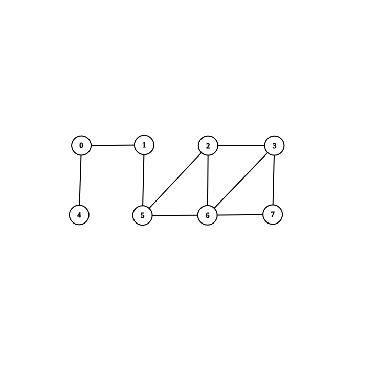

# Graph Algorithms
All graphs can be visualized using [CS Academy Graph Visualizer](https://csacademy.com/app/graph_editor/) and the input provided in the sections below.

## Undirected graphs
### createBreadthFirstSearchLectureSampleGraph()

#### Node Count:
```
8
```
#### Graph Data:
```
0 4
0 1
1 5
5 2
5 6
2 3
2 6
6 3
6 7
3 7
```

### createSampleGraph01()


#### Node Count:
```
6
```
#### Graph Data:
```
0 2
0 4
0 5
1 4
1 5
2 3
2 4
4 5
```