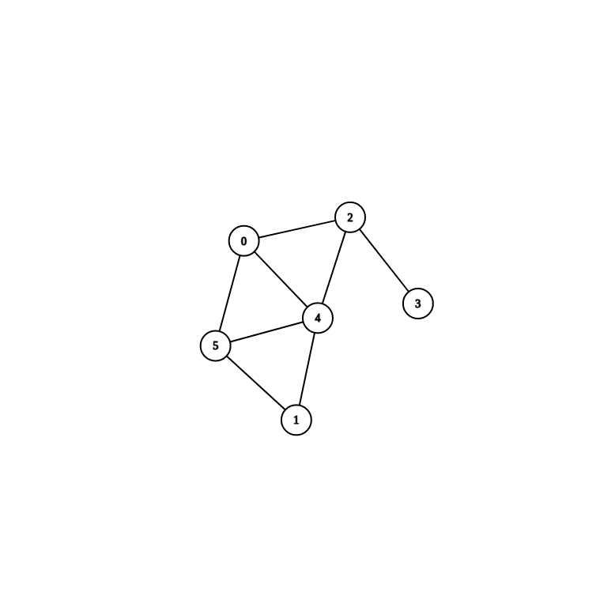

# Graph Algorithms
All graphs can be visualized using [CS Academy Graph Visualizer](https://csacademy.com/app/graph_editor/) and the input provided in the sections below.

## Table of Contents
- [Graph Algorithms](#graph-algorithms)
  - [Table of Contents](#table-of-contents)
  - [Graph Attributes](#graph-attributes)
    - [Algorithms](#algorithms)
  - [Undirected graphs](#undirected-graphs)
    - [createBreadthFirstSearchLectureSampleGraph()](#createbreadthfirstsearchlecturesamplegraph)
      - [Description](#description)
      - [Node Count:](#node-count)
      - [Graph Data:](#graph-data)
    - [createLectureSample02Graph()](#createlecturesample02graph)
      - [Description](#description-1)
      - [Node Count:](#node-count-1)
      - [Graph Data:](#graph-data-1)
    - [createSampleGraph01()](#createsamplegraph01)
      - [Node Count:](#node-count-2)
      - [Graph Data:](#graph-data-2)
    - [createBreadthFirstSearchLectureSampleGraph()](#createbreadthfirstsearchlecturesamplegraph-1)
      - [Description](#description-2)
      - [Node Count:](#node-count-3)
      - [Graph Data:](#graph-data-3)
  - [Directed graphs](#directed-graphs)
      - [Description](#description-3)
      - [Node Count:](#node-count-4)
      - [Graph Data:](#graph-data-4)

## Graph Attributes
Each graph has different attributes which can be seen looking at the graph but are also shown as a badge for each graph here. Have a look at the following table to see all badges and their meaning.

| Badge                                                                                                                                                                                      | Description                                                                                                                                                                                                              |
| ------------------------------------------------------------------------------------------------------------------------------------------------------------------------------------------ | ------------------------------------------------------------------------------------------------------------------------------------------------------------------------------------------------------------------------ |
| [](https://shields.io/) [](https://shields.io/) | Shows whether a graph is directed or not                                                                                                                                                                                 |
| [](https://shields.io/) [](https://shields.io/) | Shows whether a graph is weighted or not. "unweighted" here means the default weight 1.0 is applied!                                                                                                                     |
| [](https://GitHub.com/Naereen/ama)                                                    | Shows which algorithms of the implemented algorithms can be applied to this graph. Some algorithms won't work with any graph! See [section "Algorithms"](#algorithms) to see the meaning of the abbreviations used here. |


### Algorithms
| Abbreviation | Name                  |
| ------------ | --------------------- |
| BFS          | Breadth-First Search  |
| DFS          | Depth-First Search    |
| MST          | Minimal Spanning Tree |


## Undirected graphs
### createBreadthFirstSearchLectureSampleGraph()
[](https://shields.io/)
[](https://shields.io/)
[](https://GitHub.com/Naereen/ama)


#### Description
Graph as shown in lecture 19 on page 4 for BFS and 13 for DFS.
#### Node Count:
```
8
```
#### Graph Data:
```
0 4
0 1
1 5
5 2
5 6
2 3
2 6
6 3
6 7
3 7
```

### createLectureSample02Graph()
[](https://shields.io/)
[](https://shields.io/)
[](https://GitHub.com/Naereen/ama)


#### Description
Graph as shown in lecture 19 on page 22.
#### Node Count:
```
9
```
#### Graph Data:
```
0 1
0 4
1 2
1 6
1 8
3 4
3 7
4 5
6 7
```

### createSampleGraph01()
[](https://shields.io/)
[](https://shields.io/)
[](https://GitHub.com/Naereen/ama)



#### Node Count:
```
6
```
#### Graph Data:
```
0 2
0 4
0 5
1 4
1 5
2 3
2 4
4 5
```

### createBreadthFirstSearchLectureSampleGraph()
[](https://shields.io/)
[](https://shields.io/)
[](https://GitHub.com/Naereen/ama)


#### Description
Graph as shown in lecture 20 on page 13 for Kruskal's algorithm and page 24 for Prim's algorithm.
#### Node Count:
```
9
```
#### Graph Data:
```
0 1 4
0 8 8
1 3 8
2 3 2
2 7 6
2 8 7
3 4 7
3 6 4
4 5 9
4 6 14
5 6 10
6 7 2
7 8 1
```

## Directed graphs
[](https://shields.io/)
[](https://shields.io/)
[](https://GitHub.com/Naereen/ama)


#### Description
Graph as shown in lecture 19 on page 26.
#### Node Count:
```
9
```
#### Graph Data:
```
0 4
1 0
1 6
1 8
2 1
4 3
5 4
6 7
7 3

```